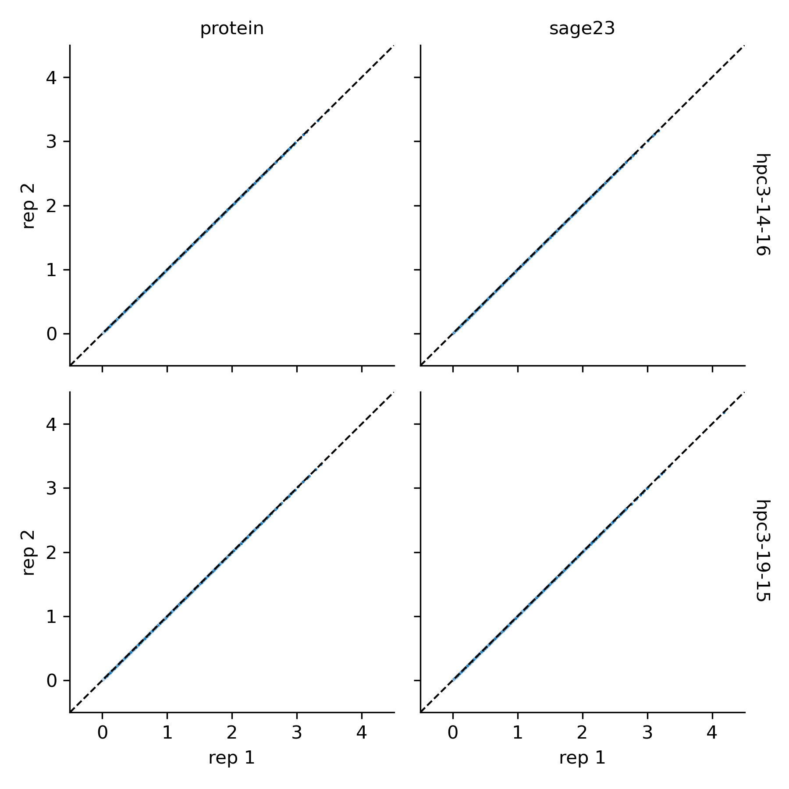
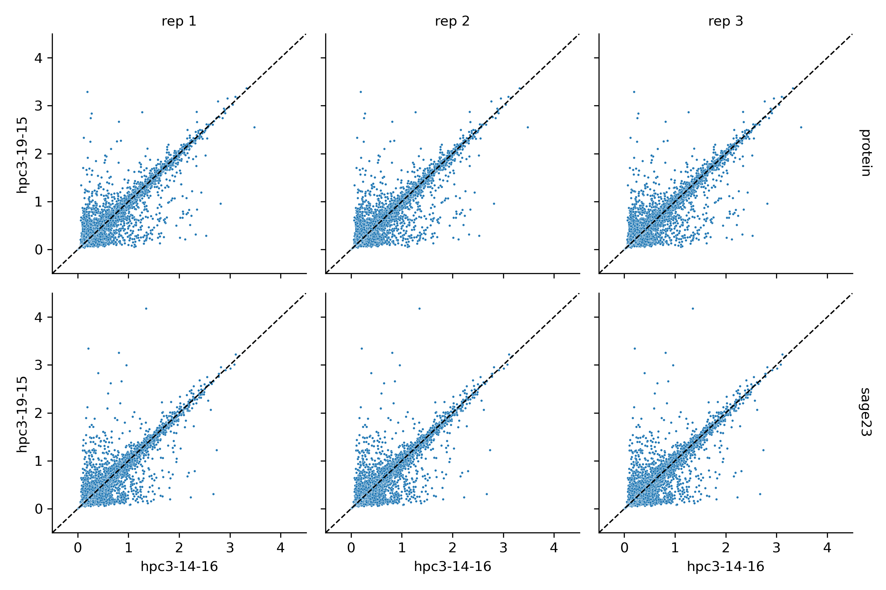

# Running yammbs benchmark on different UCI hardware

The scripts and plots here demonstrate how to, and the effect of, running yammbs benchmarks on particular hardware.

Most of the `.py` scripts are copied wholesale from the yammbs-dataset-submission repo, as are the datasets. 

`run-benchmark-yammbs-*.sh` demonstrate use of the `nodelist` constraint. Note, as implied by the name, `nodelist` allows a list of values. You can see node specs [here](https://rcic.uci.edu/hpc3/specs.html#node-details).

Running on nodes with different CPUs can produce substantially different results for some data points. We can see the difference in three replicates.

Above, the same force field on the same hardware produces identical results (by RMSD) over each replicate.

Above, the same force field on different hardware produces some pretty different RMSDs. `hpc3-14-16` runs on a Intel(R) Xeon(R) Gold 6148 CPU @ 2.40GHz, whereas `hpc3-19-15` runs on the older Intel(R) Xeon(R) CPU E5-2699 v3 @ 2.30GHz.